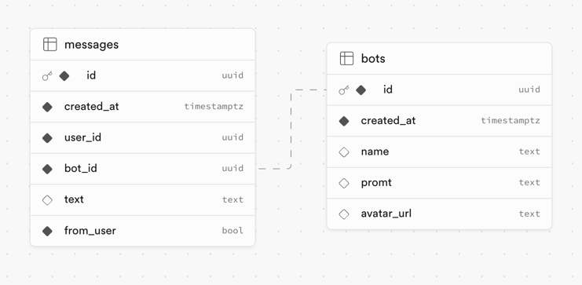

# AI Chat Application

## Demo Link
Link to test the app:

[ai-chat-test-react.vercel.app](https://ai-chat-test-react.vercel.app/)

## Overview

For Auth and Database, I used Supabase with Postgres. I created simple NodeJS server in repository
[ai-chat-test-api](https://github.com/4toc/ai-chat-test-api)
Auth handled by Supabase. I use hook to track auth state and made protected routes.

You can chat with 5 bots. They are stored in DB and promt to act like a charecter.
To store data I use Redux Toolkit.

In DB has two tables:


In backend I have 3 api routes:
1. GET `/api/chat/` - get all chatbots and their last message
2. GET `/api/chat/messages` - get messages for chatbot
3. POST `/api/chat/messages` - send message and receive response


## Prerequisites

- Node.js (version 21 or later)
- npm or yarn

## Setup

1. Install dependencies:
   ```
   npm install
   ```

2. Set up environment variables:
   Create a `.env` file in the root directory and add the following:
   ```
   VITE_SUPABASE_URL=[supabase-url]
   VITE_SUPABASE_ANON_KEY=[supabase-anon-key]
   
   VITE_API_URL=[backend-api]
   ```

3. Start the development server:
   ```
   npm run dev
   ```
4. Run server

## Ideas for improvement
Add virtual scroll for messages to handle chats with a big message history, now it's just a simple list.